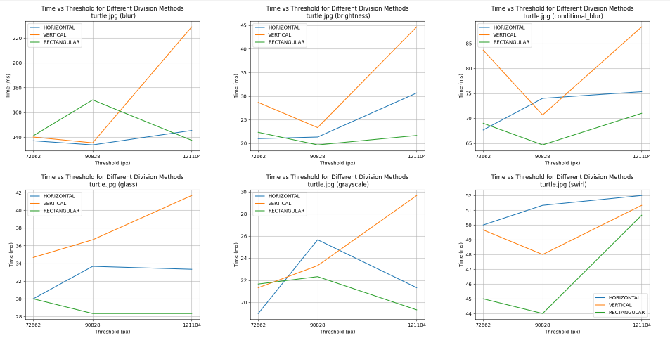
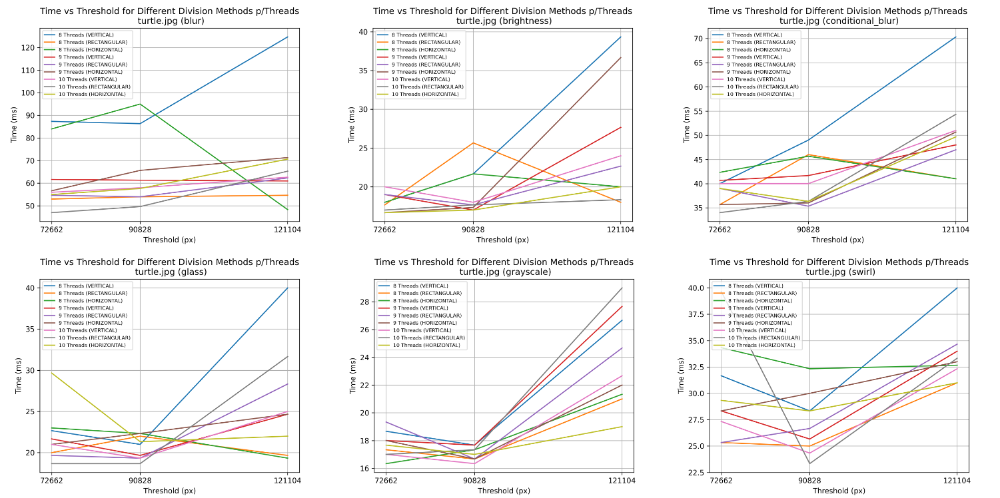
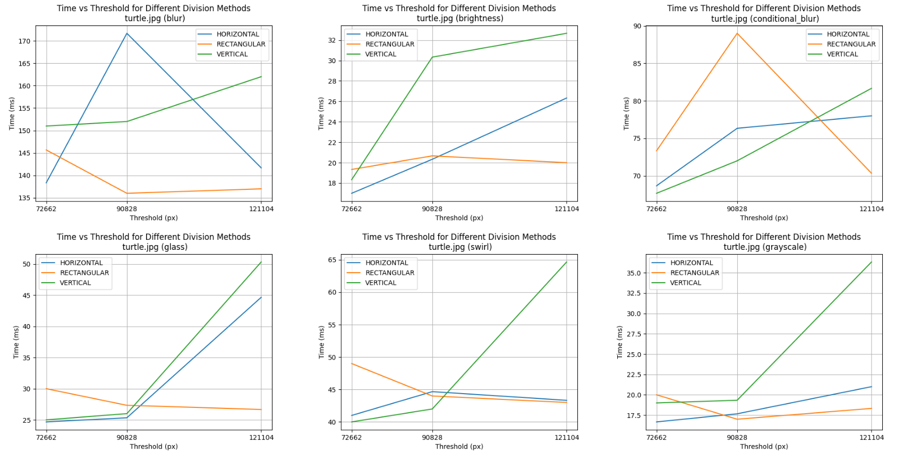

# Parallel Digital Image Processing and Analysis

**SISMD 2023/24**

### Team

- Nuno Ribeiro - 1230201@isep.ipp.pt
- Rui Neto - 1230211@isep.ipp.pt
- Simão Santos - 1230212@isep.ipp.pt
- João Vieira - 1190112@isep.ipp.pt

### Index

- [Implementation](#implementation)
  - [Division of images](#division-of-images)
  - [Filter execution](#filter-execution)
  - [Result generator](#result-generator)
    - [Sequential](#sequential)
    - [Multithread](#multithread)
    - [Executor based](#executor-based)
    - [ForkJoinPool](#forkjoinpool)
    - [Completable futures](#completable-futures)
  - [Automatic execution strategy](#automatic-execution-strategy)
  - [Execution methods implementation](#execution-methods-implementation)
    - [Sequential](#sequential-1)
    - [Multithreading](#multithreading)
    - [Executor-based](#executor-based-1)
    - [ForkJoinPool](#forkjoinpool-1)
    - [Completable futures](#completable-futures-1)
- [Analysis](#analysis)
  - [Execution details](#execution-details)
  - [Images for analysis](#images-for-analysis)
  - [SEQUENTIAL](#sequential-2)
    - [Monkey](#monkey)
    - [Turtle](#turtle)
    - [Bridge](#bridge)
  - [MULTITHREADING](#multithreading-1)
    - [Monkey](#monkey-1)
    - [Turtle](#turtle-1)
    - [Bridge](#bridge-1)
  - [EXECUTOR-BASED](#executor-based-2)
    - [Monkey](#monkey-2)
    - [Turtle](#turtle-2)
    - [Bridge](#bridge-2)
  - [FORKJOINPOOL-BASED](#forkjoinpool-based)
    - [Monkey](#monkey-3)
    - [Turtle](#turtle-3)
    - [Bridge](#bridge-3)
  - [COMPLETABLE FUTURES](#completable-futures-2)
    - [Monkey](#monkey-4)
    - [Turtle](#turtle-4)
    - [Bridge](#bridge-4)
  - [Best method for each filter](#best-method-for-each-filter)
    - [Monkey](#monkey-5)
    - [Turtle](#turtle-5)
    - [Bridge](#bridge-5)
- [Garbage Collector](#garbage-collector)
  - [SEQUENTIAL](#sequential-3)
    - [Monkey](#monkey-6)
    - [Turtle](#turtle-6)
    - [Bridge](#bridge-6)
  - [MULTITHREADING](#multithreading-2)
    - [Monkey](#monkey-7)
    - [Turtle](#turtle-7)
    - [Bridge](#bridge-7)
  - [EXECUTOR-BASED](#executor-based-3)
    - [Monkey](#monkey-8)
    - [Turtle](#turtle-8)
    - [Bridge](#bridge-8)
  - [FORKJOINPOOL-BASED](#forkjoinpool-based-1)
    - [Monkey](#monkey-9)
    - [Turtle](#turtle-9)
    - [Bridge](#bridge-9)
  - [COMPLETABLE FUTURES](#completable-futures-3)
    - [Monkey](#monkey-10)
    - [Turtle](#turtle-10)
    - [Bridge](#bridge-10)

## Implementation

The following steps describe the choices made to produce the implementation of the different types of algorithms, also all surrounding components.

### Division of images

A first analysis revealed the need to split the images for the algorithms that support the use of multiple threads simultaneously. Therefore, the strategy of using a shared image for common use by the different threads was implemented, where each thread modifies a part of the image. However, it is necessary to ensure that each of the threads does not modify an area intended for another thread. For this reason, a class was created that supports this information, as can be seen in the snippet below, where it has the range information for the column axis (N) and the range for the row axis (M), and each thread will receive this information and will  work only on this area.

```java
public record ChunkBoundaries(int lowerBoundM, int upperBoundM, int lowerBoundN, int upperBoundN) {}
```

An alternative approach could involve dividing the image among multiple threads for processing, with each thread responsible for a portion. Afterwards, another thread would assemble the processed segments into the final image. However, this method would demand to support the overhead of having a thread for storing each thread's work. In contrast, the current solution avoids conflict management as each thread exclusively handles its designated segment.

The choice for the division was three: vertical, horizontal, and rectangular. The logic behind each partition method is to take as input the number of chunks to divide and return a list of `ChunkBoundaries`, where it contains all the range coordinates for each chunk that divides the image. This type of division gives flexibility, because of the number of parameters.

### Filter execution

While analyzing the filter execution logic, we realized that the filters would be used across various types of algorithms. To address this, we created a utility class where all the filters are implemented in a static manner, enabling access from any part of the code, because the core logic it will be same always. Additionally, due to the necessity for some classes (`Callable`, `Runnable` and `RecursiveAction`) to accept filters as parameters, we created a functional interface as shown in the snippet below. This allows us to signal the intention of executions across different classes without redundancy.

```java
@FunctionalInterface
public interface Filter {
    void applyFilter(Color[][] inputImg, ChunkBoundaries boundaries, ConcurrentImage sharedImg, int amount);
}
```

This functional interface is sufficiently general to support all algorithms. It takes the input image, the boundaries of the image that the thread it will work on, as well as the shared image where the output will be written, and finally, the amount value to apply to the specific filter. With this functional interface, we can now use it in a `Callable`, just for demonstration purposes, as shown below, where it invokes whatever implementation of the interface is called.

```java
public class ExampleCallable implements Callable<Void> {
    
    public ExampleCallable(Color[][] inputImg, ChunkBoundaries boundaries, ConcurrentImage sharedImg, Filter filter, ...) {
        ...
    }

    @Override
    public Void call() {
        ...

        // If we reached the threshold
        if (pixels < threshold) {
            // General invocation of the filter method
            filter.applyFilter(inputImg, boundaries, sharedImg, amount);
        } else {
            ...
        }
    }
}
```

### Result generator

Also, another important aspect for this project, is to have the ability to obtain the performance benchmarking information of each filter's execution. For that we created a class called `PerformanceAnalyzer` that has the objective to write the logs to a `.csv` about all the important information about the execution that it occurred.

The logic behind this is that each time a filter is executed, the chronometer is started, and all the necessary information is passed, such as the number of threads, the image division, the threshold used, etc., depending on the method type. After the execution of the filter has terminated, and after writing the image to the file task has occurred, we stop the timer. The final step involves both printing the information on the screen and saving it to a file. The analyzer accumulates information in a `StringBuilder` variable throughout the execution, and at the end, it writes all the accumulated information to a file. This approach prevents interference with the algorithm execution that could occur if writing to the file were done concurrently.

Below is a code demonstration, where it first initializes and sets the `csv` headers for the specific execution. Then, for each run, it starts the chronometer before executing the filter's logic and stops after the filter's logic and writing the output file. Once all runs have inserted their lines, the file is saved on the last method `save` where it's specified the output path.

```java
    // Before any run 
    PerformanceAnalyzer performanceAnalyzer = new PerformanceAnalyzer();
    performanceAnalyzer.csvHeaders("Method;Image;Filter;Image Division Method;Number of Threads;Threshold(px);Time(ms)\n");

    ...

    // For each run 
    performanceAnalyzer.start("executor-based", imgPath, filter.name().toLowerCase(), divisionMethod, currentNumOfThreads, THRESHOLD);

    // Run filter logic

    // Stops the chronometer
    performanceAnalyzer.stop();

    ...

    // After all runs it saves the csv
    performanceAnalyzer.save(outputCSVPath);
```

The output in the `csv` file appears as follows:

```csv
Method;Image;Filter;Image Division Method;Number of Threads;Threshold(px);Time(ms)
executor-based;./input/turtle.jpg;blur;VERTICAL;8;121104;130
executor-based;./input/turtle.jpg;blur;VERTICAL;8;121104;98
executor-based;./input/turtle.jpg;grayscale;VERTICAL;8;121104;42
...
executor-based;./input/monkey.png;grayscale;RECTANGULAR;9;65536;13
executor-based;./input/monkey.png;grayscale;RECTANGULAR;9;65536;13
executor-based;./input/monkey.png;blur;VERTICAL;10;65536;47
```

Also, for more confident gathering of the information, it was defined as a rule to execute each configuration three times and then calculate the mean of the three. Additionally, the same machine was used with the goal of obtaining the most coherent information.

The information gathered by each execution is demonstrated in the following examples:

#### Sequential 

In this type of filter it's pretty straightforward, we want the filter and the time it takes to process the image.

| Image | Filter     | Time (ms) |
| ----- | ---------- | --------- |
| x.jpg | blur       | 209       |
| y.png | brightness | 33        |
| z.jpg | swirl      | 5022      |

#### Multithread

For this type of execution we add the information about the division that it was made on the image, also the number of threads used.

| Image | Filter           | Image Division | Number Threads | Time (ms) |
| ----- | ---------------- | -------------- | -------------- | --------- |
| x.jpg | blur             | VERTICAL       | 8              | 86        |
| y.png | conditional_blur | HORIZONTAL     | 9              | 84        |
| z.jpg | swirl            | RECTANGULAR    | 10             | 3141      |
  

#### Executor based 

In this type of strategy, because it is necessary to define a limit to stop the division of images, we add the threshold information in pixels.

| Image | Filter           | Threshold (pixels) | Image Division | Number Threads | Time (ms) |
| ----- | ---------------- | ------------------ | -------------- | -------------- | --------- |
| x.jpg | blur             | 90828              | RECTANGULAR    | 8              | 55        |
| y.png | grayscale        | 65536              | HORIZONTAL     | 9              | 14        |
| z.jpg | conditional_blur | 8004000            | HORIZONTAL     | 8              | 5325      |


#### ForkJoinPool 

For the fork join table it's gathered the following information.

| Image | Filter     | Threshold (pixels) | Image Division | Time (ms) |
| ----- | ---------- | ------------------ | -------------- | --------- |
| x.jpg | glass      | 72662              | VERTICAL       | 41        |
| y.png | brightness | 52328              | RECTANGULAR    | 13        |
| z.jpg | grayscale  | 6003000            | VERTICAL       | 3300      |


#### Completable futures 

In the completable futures the threshold is focused on how many parts (called chunks) the image is divided.

| Image | Filter | Chunks | Image Division | Number Threads | Time (ms) |
| ----- | ------ | ------ | -------------- | -------------- | --------- |
| x.jpg | glass  | 8      | VERTICAL       | 8              | 31        |
| y.png | swirl  | 12     | RECTANGULAR    | 10             | 18        |
| z.jpg | blur   | 16     | RECTANGULAR    | 8              | 3900      |


> Note: This was only a sample demonstration focused on showing what metrics are collected for each execution method. In the following report all results will be shown in the form of a graph.

### Automatic execution strategy

To simplify and facilitate each execution, individual main classes were created for different types of execution scenarios. These classes allow users to customize the execution by providing details related to each filter algorithm, such as the amounts to be used. Users can also specify the list of filters to operate, the images to process, the types of image divisions to apply (if necessary), and the number of threads to utilize (if applicable). This approach aims to provide flexibility and ease of use, enabling users to customize the execution.

After the user sets all the parameters, the code will loop through each specified list or significant value, automatically executing the tasks. It manages the starting and stopping of the `PerformanceAnalyzer` and handles writing to the output file.

The provided snippet illustrates the `ExecutorBasedImpl` class as a demonstration case, showcasing the configuration fields and the loops used to proceed with the execution. In summary, considering 3 division types, 6 filters, and 3 images with different thresholds, a single execution will generate 162 output lines to a `csv` file. Subsequently, we aggregate all the results and calculate the mean time across the 3 runs to obtain a representative average.

> Note: The aim was to set the number of threads close to the number of CPU cores, with a slight addition of 1 or 2 extra threads. This helps to prevent excessive overhead from thread management while maximizing CPU utilization.


```java
ExecutorBasedImpl {

    public static void main(String[] args) {

        // List of threads
        final List<Integer> numOfThreads = List.of(8, 9, 10);

        // Image configuration
        final List<Integer> turtleThresholds = List.of(121104, 90828, 72662);
        final List<Integer> monkeyThresholds = List.of(87381, 65536, 52428);
        final List<Integer> bridgeThresholds = List.of(8004000, 6003000, 4802400);

        // List of image division
        final List<ImageDivisionEnum> divisionConf = List.of(VERTICAL, HORIZONTAL, RECTANGULAR);

        // List of filters to run
        final List<FiltersEnum> filtersConf = List.of(BLUR, BRIGHTNESS, CONDITIONAL_BLUR, GLASS, GRAYSCALE, SWIRL);

        // Filters configuration
        final int BLUR_AMOUNT = 5;
        final int BRIGHTNESS_AMOUNT = 70;
        final int CONDITIONAL_BLUR_AMOUNT = 10;
        final int GLASS_BIAS = 2;
        final int GRAYSCALE_CONTRAST = 5;
        final int SWIRL_AMOUNT = 2;

        // Files paths
        final String inputDirPath = "./input/";
        final String outputDirPath = "./output/";
        final String outputLogFile = "./output/log.txt";

        // Images to process
        final List<String> imgPathList = List.of(inputDirPath + "turtle.jpg", inputDirPath + "monkey.png", inputDirPath + "bridge.jpg");

        // Number of runs
        final int RUNS = 3;

        // Number of thresholds
        final int THRESHOLD_LENGTH = 3;

        ...
        
        // For each image
        for (String imgPath : imgPathList) {

            ...

            // Reply for each threshold
            for (int t = 0; t < THRESHOLD_LENGTH; t++) {

                // Reply for each thread number
                for (var currentNumOfThreads : numOfThreads) {

                    ...

                    // For each division type
                    for (var divisionMethod : divisionConf) {

                        ...

                        // For each filter
                        for (var filter : filtersConf) {

                            ...

                              // Reply N runs
                            for (int k = 0; k < RUNS; k++) {
                              ...
                            }
                        }
                    }
                }        
            }
        }
    }
}
```


### Execution methods implementation

In the following sections, the implementations adopted by each execution method will be described.

#### Sequential

The logic behind the sequential execution is straightforward: given an image, it will execute the specified filter on the entire image. This approach processes the image in a single thread.

#### Multithreading

For this execution type, a Runnable class was developed to handle the execution of the filter logic. To simplify, a lambda function was employed to execute the static implementation of the filter. Since multiple threads are utilized, they are initialized in a loop, and subsequently, we wait for all threads to complete using the `.join` method. 

Since we will have multiple threads running concurrently, we will divide the image into segments corresponding to the number of threads. Each thread will then be assigned a chunk of the image to process independently.

In bellow, it's a snippet code of a simplified version of the real one, in order to illustrate the logic.

```java
int NumOfThreads = 8

Thread[] threads = new Thread[NumOfThreads];

for (int i = 0; i < threads.length; i++) {

    // Get the chunks that the thread it will execute
    ChunkBoundaries[] chunks = getChunksOf(imageAsChunk, NumOfThreads, VERTICAL);

    // Create the runnable to run inside of the Thread
    Runnable runnable = () -> GrayscaleFilter.exec(image, chunk, outputImg, GRAYSCALE_CONTRAST);

    // Starts the Thread
    threads[i] = new Thread(runnable);
    threads[i].start();
}

// Waits for the thread
try {
    for (Thread thread : threads) {
        thread.join();
    }
} catch (Exception e) {
    System.out.println("Interrupted!");
}

```

#### Executor-based

In the executor-based implementation, a class implementing the Callable interface was defined. Instances of this class can be submitted to an executor, allowing threads in the pool to process tasks in parallel. The objective is to divide the image into n chunks, with each chunk being equivalent to a task processed by a thread. To achieve this, a recursive approach was adopted where the Callable definition itself calls recursively, dividing the image until it reaches a specified threshold. Each resulting chunk generates a new Callable instance responsible for processing that particular chunk.

To gather a substantial amount of data, the execution of this method was approached with the following considerations:
- Thresholds for the turtle/monkey/bridge image: Various thresholds were applied to prevent excessive image divisions, thereby controlling the number of tasks generated.
- Number of Threads: How many threads are managed by the ExecutorService, which defines the level of concurrency.
- Division Method: The method used to divide the image (vertical, horizontal or rectangular).
- Filters: Different image processing filters - blur, brightness, conditional blur, glass, grayscale and swirl.
- Runs: Each configuration is tested multiple times (defined by RUNS, in this case 3) to gather average performance metrics.

The following snippet presents an excerpt of the Callable implementation.

```java
...
for (String imgPath : imgPathList) {
    String imageName = imgPath.substring(imgPath.lastIndexOf("/") + 1, imgPath.lastIndexOf("."));
    Color[][] image = ImageUtils.loadImage(imgPath);
    ChunkBoundaries imageAsChunk = new ChunkBoundaries(0, image.length - 1, 0, image[0].length - 1);

    for (int t = 0; t < 3; t++) {
        for (var currentNumOfThreads : numOfThreads) {
            ExecutorService executor = Executors.newFixedThreadPool(currentNumOfThreads);

            for (var divisionMethod : divisionConf) {
                var THRESHOLD = switch (imageName) {
                    case "turtle" -> turtleThresholds.get(t);
                    case "monkey" -> monkeyThresholds.get(t);
                    case "bridge" -> bridgeThresholds.get(t);
                    default -> throw new IllegalStateException("Missing threshold for image");
                };

                for (var filter : filtersConf) {
                    String outputPath = outputDirPath + imageName + "_" + filter.name().toLowerCase() + "_executor_based.jpg";
                    ConcurrentImage outputImg = new ConcurrentImage(ImageUtils.copyImage(image));

                    for (int k = 0; k < RUNS; k++) {
                        performanceAnalyzer.start("executor-based", imgPath, filter.name().toLowerCase(), divisionMethod,
                                currentNumOfThreads, THRESHOLD);

                        Callable<Void> callable = switch (filter) {
                            case BLUR -> new FilterCallable(image, imageAsChunk, outputImg, divisionMethod,
                                    executor, BlurFilter::exec, THRESHOLD, BLUR_AMOUNT);

                            case BRIGHTNESS ->
                                    new FilterCallable(image, imageAsChunk, outputImg, divisionMethod,
                                            executor, BrightnessFilter::exec, THRESHOLD, BRIGHTNESS_AMOUNT);

                            case CONDITIONAL_BLUR ->
                                    new FilterCallable(image, imageAsChunk, outputImg, divisionMethod,
                                            executor, ConditionalBlurFilter::exec, THRESHOLD, CONDITIONAL_BLUR_AMOUNT);

                            case GLASS -> new FilterCallable(image, imageAsChunk, outputImg, divisionMethod,
                                    executor, GlassFilter::exec, THRESHOLD, GLASS_BIAS);

                            case GRAYSCALE -> new FilterCallable(image, imageAsChunk, outputImg, divisionMethod,
                                    executor, GrayscaleFilter::exec, THRESHOLD, GRAYSCALE_CONTRAST);

                            case SWIRL -> new FilterCallable(image, imageAsChunk, outputImg, divisionMethod,
                                    executor, SwirlFilter::exec, THRESHOLD, SWIRL_AMOUNT);
                        };

                        executor.submit(callable).get();
                        ImageUtils.writeImage(outputImg.get(), outputPath);
                        performanceAnalyzer.stop();
                    }
                }
            }
            executor.shutdown();
        }
    }
}
...
```


#### ForkJoinPool

Regarding the implementation of the execution method ForkJoinPool, the team went with the following approach.

First the creation of the FilterRecursiveAction class that represents the recursive actions to apply filter, because this kind of executor service differs from the others mainly because of employing divide-and-conquer methods, where tasks are subdivided into smaller tasks and then they are handled in parallel. 

The following class has some particularities, first one and very important is "extends Recursive Action", for our use case we need this because this allows to create a task that has a void return type and it's normally used for tasks that can be divided and executed in parallel.

The task logic it self is set inside the compute() method, that in this case it will split the image into smaller chunks if the number of pixels exceeds the threshold, then invokes the filter recursively on each chunk or directly applies the filter if the threshold is met.

```java
public class FilterRecursiveAction extends RecursiveAction {
   ...

    @Override
    protected void compute() {
        int xLength = chunkBoundaries.upperBoundN() - chunkBoundaries.lowerBoundN() + 1;
        int yLength = chunkBoundaries.upperBoundM() - chunkBoundaries.lowerBoundM() + 1;
        int pixels = xLength * yLength;

        if (pixels <= threshold) {
            filter.applyFilter(image, chunkBoundaries, outputImg, amount);
        } else {
            ChunkBoundaries[] chunks;
            if (divisionMethod == ImageDivisionEnum.RECTANGULAR) {
                chunks = getChunksOf(chunkBoundaries, 4, divisionMethod);
            } else {
                chunks = getChunksOf(chunkBoundaries, 2, divisionMethod);
            }

            for (var chunk : chunks) {
                FilterRecursiveAction filterTask = new FilterRecursiveAction(image, chunk, outputImg, divisionMethod, filter, threshold, amount);
                invokeAll(filterTask);
            }
        }
    }
}
```

Then we have the ForkJoinPoolImpl Class, which is really where it manages the applying of filters on different images, for parallel execution of filter tasks.
To do this there's a nested loop to iterate over thresholds, division methods and filters for each image, and for each a new instance FilterRecursive is created.

Then to manage parallel execution, the code uses the "ForkJoinPool" to manage a pool of threads, after having a pool of treads and the actions that need to be executed, it calls the invoke() method to start the parallel execution of tasks.

To gather a good amount of data, this method was executed with the different considerations like thresholds, number of threads, division method (vertical, horizontal or rectangular), the filter and the number of runs(each configuration is tested multiple times in this case 3 to gather average performance metrics).


```java  
for (String imgPath : imgPathList) {
    String imageName = imgPath.substring(imgPath.lastIndexOf("/") + 1, imgPath.lastIndexOf("."));
    Color[][] image = ImageUtils.loadImage(imgPath);
    ChunkBoundaries imageAsChunk = new ChunkBoundaries(0, image.length - 1, 0, image[0].length - 1);

    for (int t = 0; t < 3; t++) {
        for (var divisionMethod : divisionConf) {
            var THRESHOLD = switch (imageName) {
                case "turtle" -> turtleThresholds.get(t);
                case "monkey" -> monkeyThresholds.get(t);
                case "bridge" -> bridgeThresholds.get(t);
                default -> throw new IllegalStateException("Missing threshold for image");
            };

            for (var filter : filtersConf) {
                String outputPath = outputDirPath + imageName + "_" + filter.name().toLowerCase() + "_ForkJoinPool_based.jpg";
                ConcurrentImage outputImg = new ConcurrentImage(ImageUtils.copyImage(image));

                for (int k = 0; k < RUNS; k++) {
                    performanceAnalyzer.start("fork-join pool", imgPath, filter.name().toLowerCase(), divisionMethod, THRESHOLD);

                    FilterRecursiveAction task = switch (filter) {
                        case BLUR ->
                                new FilterRecursiveAction(image, imageAsChunk, outputImg, divisionMethod, BlurFilter::exec, THRESHOLD, BLUR_AMOUNT);

                        case BRIGHTNESS ->
                                new FilterRecursiveAction(image, imageAsChunk, outputImg, divisionMethod, BrightnessFilter::exec, THRESHOLD, BRIGHTNESS_AMOUNT);

                        case CONDITIONAL_BLUR ->
                                new FilterRecursiveAction(image, imageAsChunk, outputImg, divisionMethod, ConditionalBlurFilter::exec, THRESHOLD, CONDITIONAL_BLUR_AMOUNT);

                        case GLASS ->
                                new FilterRecursiveAction(image, imageAsChunk, outputImg, divisionMethod, GlassFilter::exec, THRESHOLD, GLASS_BIAS);

                        case GRAYSCALE ->
                                new FilterRecursiveAction(image, imageAsChunk, outputImg, divisionMethod, GrayscaleFilter::exec, THRESHOLD, GRAYSCALE_CONTRAST);

                        case SWIRL ->
                                new FilterRecursiveAction(image, imageAsChunk, outputImg, divisionMethod, SwirlFilter::exec, THRESHOLD, SWIRL_AMOUNT);
                    };

                    forkJoinPool.invoke(task);
                    ImageUtils.writeImage(outputImg.get(), outputPath);
                    performanceAnalyzer.stop();
                }
            }
        }
    }
}                
``` 

#### Completable futures

In the **completable futures** method, the primary loop processes a predefined list of images using a nested loop structure that iterates over different configurations:

- Number of Chunks: How many parts each image is divided into for concurrent processing.
- Number of Threads: How many threads are managed by the ExecutorService, which defines the level of concurrency.
- Division Method: The method used to divide the image (vertical, horizontal or rectangular).
- Filters: Different image processing filters - blur, brightness, conditional blur, glass, grayscale and swirl.
- Runs: Each configuration is tested multiple times (defined by RUNS, in this case 3) to gather average performance metrics.

Then, for each configuration:

An ExecutorService is created with the specified number of threads. The image is divided into chunks based on the current division method. For each chunk, a CompletableFuture is created and submitted to the executor. Each future applies the specific filter to its chunk of the image.

All futures are combined using `CompletableFuture.allOf()` and then the `.get()` which waits for all processing to complete.
Once all chunks are processed, the resultant image is written to the disk, and performance timing is logged.

After processing all configurations for an image, performance data is saved to the CSV file. The executor is shut down after completing tasks for each configuration **to free up resources**.

A simple snippet of the implementation using completable futures is shown below:

```java
public class CompletableFuturesImpl {
    public static void main(String[] args) throws ExecutionException, InterruptedException {
        // DEFINE GENERAL CONFIGS
        // DEFINE FILES PATH
        // DEFINE IMAGES TO PROCESS
        // DEFINE PERFORMANCE ANALYZER

        for (each image) {
            for (each chunk) {
                for (each thread number) {
                    for (each division method) {
                        for (each filter) {
                            for (each run) {
                                // INIT EXECUTOR AND GET THE CHUNKS
                                // INIT CHUNK FUTURES LIST
                                // START PERFORMANCE ANALYZER

                                for (each chunk) {
                                    CompletableFuture<Void> chunkFuture = CompletableFuture.runAsync(() -> {
                                        switch (filter) {
                                            // APPLY THE FILTER TO THE CHUNK
                                        }
                                    }, executor);
                                    chunkFutures.add(chunkFuture);
                                }

                                var future = CompletableFuture.allOf(chunkFutures.toArray(new CompletableFuture[0])).thenRunAsync(() -> {
                                    ImageUtils.writeImage(outputImg.get(), outputPath);
                                    performanceAnalyzer.stop();
                                }, executor);

                                // WAIT FOR ALL THE CHUNKS TO BE PROCESSED BEFORE SHUT DOWN THE EXECUTOR
                                future.get();
                                executor.shutdown();
                            }
                        }
                    }
                }
            }
        }
    }
}
```

## Analysis

In the following sections, the results obtained from all the executions for different types of implementations will be presented. The final objective is to determine the optimal filter settings for each image. The analysis data can be found [here](./analysis_data.xlsx).

### Execution details

- **CPU:** Intel® Core™ i5-10300H × 8
- **RAM:** 8 GiB
- **Number of thread/Logical processors:** 8
- **JDK:** openjdk 21.0.2

### Images for analysis

- **Monkey:** 512x512 PNG (24-bit color) 65 KB
- **Turtle:** 696x522 JPG (24-bit color) 90.5 KB
- **Bridge:** 6000x4002 JPG (24-bit color) 2.24 MB

### SEQUENTIAL

The sequential implementation serves as the base reference for the other implementations. It doesn't involve comparisons across different configurations,instead, it processes the image sequentially with a single configuration.

#### Monkey

| Filter           | Time (ms) |
| ---------------- | --------- |
| blur             | 112.7     |
| brightness       | 13.7      |
| conditional_blur | 253.7     |
| glass            | 20.7      |
| grayscale        | 13.3      |
| swirl            | 31        |

#### Turtle

| Filter           | Time (ms) |
| ---------------- | --------- |
| blur             | 209.7     |
| brightness       | 33.7      |
| conditional_blur | 90.7      |
| glass            | 45.7      |
| grayscale        | 28.3      |
| swirl            | 56        |

#### Bridge

| Filter           | Time (ms) |
| ---------------- | --------- |
| blur             | 10253     |
| brightness       | 1812      |
| conditional_blur | 8445      |
| glass            | 2456      |
| grayscale        | 1812      |
| swirl            | 5022      |

---

### MULTITHREADING

#### Monkey


| Filter           | Image Division | Number Threads | Time (ms) |
| ---------------- | -------------- | -------------- | --------- |
| blur             | HORIZONTAL     | 9              | 46.7      |
| brightness       | RECTANGULAR    | 10             | 13        |
| conditional_blur | RECTANGULAR    | 10             | 80.3      |
| glass            | VERTICAL       | 8              | 17.7      |
| grayscale        | RECTANGULAR    | 10             | 16.7      |
| swirl            | RECTANGULAR    | 9              | 21        |

#### Turtle


| Filter           | Image Division | Number Threads | Time (ms) |
| ---------------- | -------------- | -------------- | --------- |
| blur             | HORIZONTAL     | 9              | 58.3      |
| brightness       | VERTICAL       | 9              | 23.3      |
| conditional_blur | VERTICAL       | 10             | 38        |
| glass            | RECTANGULAR    | 9              | 24.7      |
| grayscale        | HORIZONTAL     | 9              | 19.3      |
| swirl            | HORIZONTAL     | 8              | 31.7      |

#### Bridge


| Filter           | Image Division | Number Threads | Time (ms) |
| ---------------- | -------------- | -------------- | --------- |
| blur             | HORIZONTAL     | 8              | 4234      |
| brightness       | VERTICAL       | 9              | 2023      |
| conditional_blur | VERTICAL       | 8              | 4279      |
| glass            | VERTICAL       | 8              | 2126      |
| grayscale        | VERTICAL       | 8              | 1987      |
| swirl            | VERTICAL       | 10             | 2894      |

---

### EXECUTOR-BASED

#### Monkey


| Filter           | Image Division | Number Threads | Threshold (px) | Time (ms) |
| ---------------- | -------------- | -------------- | -------------- | --------- |
| blur             | RECTANGULAR    | 10             | 90828          | 35.3      |
| brightness       | RECTANGULAR    | 10             | 87381          | 13        |
| conditional_blur | RECTANGULAR    | 9              | 65536          | 76.3      |
| glass            | RECTANGULAR    | 10             | 52428          | 15.3      |
| grayscale        | HORIZONTAL     | 8              | 87381          | 12        |
| swirl            | RECTANGULAR    | 9              | 52428          | 19        |

#### Turtle


| Filter           | Image Division | Number Threads | Threshold (px) | Time (ms) |
| ---------------- | -------------- | -------------- | -------------- | --------- |
| blur             | RECTANGULAR    | 10             | 90828          | 49        |
| brightness       | RECTANGULAR    | 9              | 121104         | 18        |
| brightness       | VERTICAL       | 10             | 90828          | 18        |
| brightness       | HORIZONTAL     | 8              | 90828          | 18        |
| conditional_blur | RECTANGULAR    | 9              | 90828          | 34.6      |
| glass            | RECTANGULAR    | 9              | 90828          | 19.6      |
| grayscale        | VERTICAL       | 10             | 121104         | 17        |
| swirl            | RECTANGULAR    | 10             | 72662          | 24.3      |

#### Bridge


| Filter           | Image Division | Number Threads | Threshold (px) | Time (ms) |
| ---------------- | -------------- | -------------- | -------------- | --------- |
| blur             | RECTANGULAR    | 9              | 4802400        | 5152.6    |
| brightness       | HORIZONTAL     | 9              | 4802400        | 2949.3    |
| conditional_blur | RECTANGULAR    | 10             | 4802400        | 3371.6    |
| glass            | HORIZONTAL     | 8              | 8004000        | 3356.6    |
| grayscale        | HORIZONTAL     | 9              | 4802400        | 2910.3    |
| swirl            | RECTANGULAR    | 8              | 6003000        | 3477      |

---

### FORKJOINPOOL-BASED

#### Monkey


 | Filter           | Threshold (pixels) | Image Division | Time (ms) |
 | ---------------- | ------------------ | -------------- | --------- |
 | Blur             | 52428              | HORIZONTAL     | 96.3      |
 | Brightness       | 65536              | HORIZONTAL     | 14.7      |
 | Conditional Blur | 65536              | RECTANGULAR    | 64.7      |
 | Glass            | 87381              | RECTANGULAR    | 21.3      |
 | Grayscale        | 87381              | HORIZONTAL     | 14        |
 | Swirl            | 65536              | VERTICAL       | 32        |

#### Turtle



 | Filter           | Threshold (pixels) | Image Division | Time (ms) |
 | ---------------- | ------------------ | -------------- | --------- |
 | Blur             | 90828              | HORIZONTAL     | 133.7     |
 | Brightness       | 90828              | RECTANGULAR    | 21.7      |
 | Conditional Blur | 90828              | RECTANGULAR    | 64.7      |
 | Glass            | 121104             | RECTANGULAR    | 28.3      |
 | Grayscale        | 72662              | HORIZONTAL     | 19        |
 | Swirl            | 90828              | RECTANGULAR    | 44        |

#### Bridge


 | Filter           | Threshold (pixels) | Image Division | Time (ms) |
 | ---------------- | ------------------ | -------------- | --------- |
 | Blur             | 8.004              | HORIZONTAL     | 10179     |
 | Brightness       | 6.003              | HORIZONTAL     | 3031      |
 | Conditional Blur | 4.802              | VERTICAL       | 8649.3    |
 | Glass            | 4.802              | RECTANGULAR    | 4214      |
 | Grayscale        | 8.004              | HORIZONTAL     | 3008.3    |
 | Swirl            | 8.004              | VERTICAL       | 5309.7    |

---

### COMPLETABLE FUTURES

#### Monkey


| Filter           | Chunks | Image Division | Number Threads | Time (ms) |
| ---------------- | ------ | -------------- | -------------- | --------- |
| blur             | 12     | VERTICAL       | 10             | 37.3      |
| brightness       | 8      | RECTANGULAR    | 10             | 13.7      |
| conditional_blur | 16     | VERTICAL       | 10             | 73        |
| glass            | 8      | HORIZONTAL     | 8              | 15.3      |
| grayscale        | 8      | HORIZONTAL     | 8              | 12.7      |
| swirl            | 12     | RECTANGULAR    | 10             | 18.3      |

#### Turtle


| Filter           | Chunks | Image Division | Number Threads | Time (ms) |
| ---------------- | ------ | -------------- | -------------- | --------- |
| blur             | 16     | RECTANGULAR    | 9              | 47.7      |
| brightness       | 12     | HORIZONTAL     | 8              | 19        |
| conditional_blur | 12     | VERTICAL       | 8              | 33.3      |
| glass            | 4      | RECTANGULAR    | 9              | 19.7      |
| grayscale        | 12     | HORIZONTAL     | 8              | 17        |
| swirl            | 12     | RECTANGULAR    | 8              | 24.7      |

#### Bridge


| Filter           | Chunks | Image Division | Number Threads | Time (ms) |
| ---------------- | ------ | -------------- | -------------- | --------- |
| blur             | 16     | RECTANGULAR    | 9              | 3793.3    |
| brightness       | 8      | RECTANGULAR    | 9              | 1763.7    |
| conditional_blur | 16     | HORIZONTAL     | 8              | 3434      |
| glass            | 12     | RECTANGULAR    | 9              | 1890.3    |
| grayscale        | 8      | RECTANGULAR    | 8              | 1733      |
| swirl            | 16     | VERTICAL       | 8              | 2413.3    |

---

### Best method for each filter

#### Monkey

| Filter           | Method                               | Time (ms) |
| ---------------- | ------------------------------------ | --------- |
| blur             | Executor-Based                       | 35.3      |
| brightness       | Multi Thread / Executor-Based        | 13        |
| conditional_blur | Completable Futures                  | 73        |
| glass            | Executor-Based / Completable Futures | 15.3      |
| grayscale        | Executor-Based                       | 12        |
| swirl            | Completable Futures                  | 18.3      |

#### Turtle

| Filter           | Method                               | Time (ms) |
| ---------------- | ------------------------------------ | --------- |
| blur             | Completable Futures                  | 47.7      |
| brightness       | Executor-Based                       | 18        |
| conditional_blur | Completable Futures                  | 33.3      |
| glass            | Executor-Based                       | 19.6      |
| grayscale        | Executor-Based / Completable Futures | 17        |
| swirl            | Executor-Based                       | 24.3      |

#### Bridge

| Filter           | Method              | Time (ms) |
| ---------------- | ------------------- | --------- |
| blur             | Completable Futures | 3793.3    |
| brightness       | Completable Futures | 1763.7    |
| conditional_blur | Executor-Based      | 3371.6    |
| glass            | Completable Futures | 1890.3    |
| grayscale        | Completable Futures | 1733      |
| swirl            | Completable Futures | 2413.3    |

## Garbage Collector

### SEQUENTIAL

Garbage collector: UseSerialGC

Command: `java -javaagent:"/home/simao/.local/share/JetBrains/Toolbox/apps/intellij-idea-ultimate/lib/idea_rt.jar=41507:/home/simao/.local/share/JetBrains/Toolbox/apps/intellij-idea-ultimate/bin" -XX:+UseSerialGC -Xms3G -XX:ParallelGCThreads=8 -classpath /home/simao/isep/SISMD/p1/out/production/p1 SequentialImpl`

#### Monkey

| Filter           | Time (ms) | Difference (ms) |
| ---------------- | --------- | --------------- |
| blur             | 128.3     | +15             |
| brightness       | 19.7      | +6              |
| conditional_blur | 274.7     | +21             |
| glass            | 28.3      | +7.6            |
| grayscale        | 22.3      | +9              |
| swirl            | 37.3      | +6.3            |

#### Turtle

| Filter           | Time (ms) | Difference (ms) |
| ---------------- | --------- | --------------- |
| blur             | 206       | -3.7            |
| brightness       | 32        | -1.7            |
| conditional_blur | 90        | +0.7            |
| glass            | 45.7      | 0               |
| grayscale        | 29        | +0.7            |
| swirl            | 67.7      | +11.7           |

#### Bridge

| Filter           | Time (ms) | Difference (ms) |
| ---------------- | --------- | --------------- |
| blur             | 13743.7   | +3490.7         |
| brightness       | 3782      | +1970           |
| conditional_blur | 11339.3   | +8883.3         |
| glass            | 4027.7    | +2215.7         |
| grayscale        | 2781.7    | +969.7          |
| swirl            | 7913.3    | +2891.3         |

---

### MULTITHREADING

Garbage collector: ShenandoahGC

Command: `java -javaagent:"/home/simao/.local/share/JetBrains/Toolbox/apps/intellij-idea-ultimate/lib/idea_rt.jar=41507:/home/simao/.local/share/JetBrains/Toolbox/apps/intellij-idea-ultimate/bin" -XX:+UseShenandoahGC -Xms3G -XX:ParallelGCThreads=8 -classpath /home/simao/isep/SISMD/p1/out/production/p1 MultithreadedImpl`

#### Monkey


| Filter           | Image Division | Number Threads | Time (ms) | Difference (ms) |
| ---------------- | -------------- | -------------- | --------- | --------------- |
| blur             | RECTANGULAR    | 8              | 40.3      | -6.4            |
| brightness       | HORIZONTAL     | 10             | 14        | +1              |
| conditional_blur | RECTANGULAR    | 8              | 94        | +13.7           |
| glass            | HORIZONTAL     | 9              | 17.3      | -0.4            |
| grayscale        | RECTANGULAR    | 8              | 14        | -2.7            |
| swirl            | RECTANGULAR    | 10             | 19.3      | -1.7            |

#### Turtle


| Filter           | Image Division | Number Threads | Time (ms) | Difference (ms) |
| ---------------- | -------------- | -------------- | --------- | --------------- |
| blur             | RECTANGULAR    | 8              | 52        | -6.3            |
| brightness       | HORIZONTAL     | 10             | 18.7      | -4.6            |
| conditional_blur | VERTICAL       | 10             | 40.3      | +2.3            |
| glass            | HORIZONTAL     | 9              | 20.3      | -4.4            |
| grayscale        | VERTICAL       | 8              | 33.7      | 14.4            |
| swirl            | HORIZONTAL     | 8              | 23.7      | -8              |

#### Bridge


| Filter           | Image Division | Number Threads | Time (ms) | Difference (ms) |
| ---------------- | -------------- | -------------- | --------- | --------------- |
| blur             | VERTICAL       | 9              | 4585.3    | +351.3          |
| brightness       | VERTICAL       | 10             | 2758.3    | +735.3          |
| conditional_blur | HORIZONTAL     | 10             | 5626.3    | +1347.3         |
| glass            | RECTANGULAR    | 9              | 2742      | +755            |
| grayscale        | HORIZONTAL     | 10             | 2645.3    | +658.3          |
| swirl            | VERTICAL       | 9              | 2809.7    | -84.3           |

---

### EXECUTOR-BASED

Garbage collector: G1GC

Command: `java -javaagent:"/home/simao/.local/share/JetBrains/Toolbox/apps/intellij-idea-ultimate/lib/idea_rt.jar=41507:/home/simao/.local/share/JetBrains/Toolbox/apps/intellij-idea-ultimate/bin" -XX:+UseG1GC -Xms3G -XX:ParallelGCThreads=8 -classpath /home/simao/isep/SISMD/p1/out/production/p1 ExecutorBasedImpl`

#### Monkey


| Filter           | Image Division | Number Threads | Threshold (px) | Time (ms) | Difference (ms) |
| ---------------- | -------------- | -------------- | -------------- | --------- | --------------- |
| blur             | RECTANGULAR    | 10             | 65536          | 34        | -1.3            |
| brightness       | VERTICAL       | 9              | 87381          | 12.3      | -0.7            |
| conditional_blur | RECTANGULAR    | 10             | 52428          | 70        | -6.3            |
| glass            | HORIZONTAL     | 10             | 87381          | 14.3      | -1              |
| grayscale        | HORIZONTAL     | 10             | 65536          | 11.7      | -0.3            |
| swirl            | RECTANGULAR    | 10             | 65536          | 18        | -1              |

#### Turtle



| Filter           | Image Division | Number Threads | Threshold (px) | Time (ms) | Difference (ms) |
| ---------------- | -------------- | -------------- | -------------- | --------- | --------------- |
| blur             | RECTANGULAR    | 10             | 72662          | 47        | -2              |
| brightness       | HORIZONTAL     | 9              | 72662          | 16.7      | -1.3            |
| conditional_blur | RECTANGULAR    | 10             | 72662          | 34        | -0.6            |
| glass            | RECTANGULAR    | 10             | 90828          | 18.7      | -0.9            |
| grayscale        | VERTICAL       | 10             | 90828          | 16.3      | -0.7            |
| swirl            | RECTANGULAR    | 10             | 90828          | 23.3      | -0.7            |

#### Bridge


| Filter           | Image Division | Number Threads | Threshold (px) | Time (ms) | Difference (ms) |
| ---------------- | -------------- | -------------- | -------------- | --------- | --------------- |
| blur             | RECTANGULAR    | 10             | 8004000        | 3242.3    | -1910.3         |
| brightness       | RECTANGULAR    | 10             | 4802400        | 1333      | -1616.3         |
| conditional_blur | HORIZONTAL     | 10             | 6003000        | 3378.3    | +6.7            |
| glass            | RECTANGULAR    | 10             | 4802400        | 1455      | -1901.6         |
| grayscale        | RECTANGULAR    | 8              | 8004000        | 1314.3    | -1596           |
| swirl            | RECTANGULAR    | 10             | 4802400        | 2118.3    | -1358.7         |

---

### FORKJOINPOOL-BASED

Garbage collector: ParallelGCThreads

Command: `java -javaagent:"/home/simao/.local/share/JetBrains/Toolbox/apps/intellij-idea-ultimate/lib/idea_rt.jar=41507:/home/simao/.local/share/JetBrains/Toolbox/apps/intellij-idea-ultimate/bin" -XX:+UseParallelGC -Xms3G -XX:ParallelGCThreads=8 -classpath /home/simao/isep/SISMD/p1/out/production/p1 ForkJoinPoolImpl`

#### Monkey


| Filter           | Threshold (px) | Image Division | Time (ms) | Difference (ms) |
| ---------------- | -------------- | -------------- | --------- | --------------- |
| blur             | 52428          | HORIZONTAL     | 97.7      | +1.4            |
| brightness       | 65536          | HORIZONTAL     | 18        | +3.3            |
| conditional_blur | 65536          | RECTANGULAR    | 189       | +124.3          |
| glass            | 87381          | RECTANGULAR    | 18        | -3.3            |
| grayscale        | 87381          | HORIZONTAL     | 12.7      | -1.3            |
| swirl            | 65536          | VERTICAL       | 30.3      | -1.7            |

#### Turtle



| Filter           | Threshold (px) | Image Division | Time (ms) | Difference (ms) |
| ---------------- | -------------- | -------------- | --------- | --------------- |
| blur             | 90828          | HORIZONTAL     | 171.7     | +37.9           |
| brightness       | 90828          | RECTANGULAR    | 20.7      | -1              |
| conditional_blur | 90828          | RECTANGULAR    | 89        | +24.3           |
| glass            | 121104         | RECTANGULAR    | 26.7      | -1.6            |
| grayscale        | 72662          | HORIZONTAL     | 16.7      | -2.3            |
| swirl            | 90828          | RECTANGULAR    | 44        | 0               |

#### Bridge


| Filter           | Threshold (px) | Image Division | Time (ms) | Difference (ms) |
| ---------------- | -------------- | -------------- | --------- | --------------- |
| blur             | 8.004          | HORIZONTAL     | 12175.3   | +1996.3         |
| brightness       | 6.003          | HORIZONTAL     | 4380.6    | +1349.6         |
| conditional_blur | 4.802          | VERTICAL       | 9109      | +459.7          |
| glass            | 4.802          | RECTANGULAR    | 4478      | +268            |
| grayscale        | 8.004          | HORIZONTAL     | 4190.3    | +3008.3         |
| swirl            | 8.004          | VERTICAL       | 7157.7    | +1847.9         |

---

### COMPLETABLE FUTURES

Garbage collector: G1GC

Command: `java -javaagent:"/home/simao/.local/share/JetBrains/Toolbox/apps/intellij-idea-ultimate/lib/idea_rt.jar=41507:/home/simao/.local/share/JetBrains/Toolbox/apps/intellij-idea-ultimate/bin" -XX:+UseG1GC -Xms3G -XX:ParallelGCThreads=8 -classpath /home/simao/isep/SISMD/p1/out/production/p1 CompletableFuturesImpl`

#### Monkey


| Filter           | Chunks | Image Division | Number Threads | Time (ms) | Difference (ms) |
| ---------------- | ------ | -------------- | -------------- | --------- | --------------- |
| blur             | 8      | RECTANGULAR    | 8              | 35.3      | -2              |
| brightness       | 4      | HORIZONTAL     | 9              | 12.3      | -1.6            |
| conditional_blur | 16     | HORIZONTAL     | 9              | 63        | -10             |
| glass            | 16     | HORIZONTAL     | 10             | 14        | -1.3            |
| grayscale        | 4      | VERTICAL       | 10             | 12        | -0.7            |
| swirl            | 8      | HORIZONTAL     | 8              | 17        | -1.3            |

#### Turtle


| Filter           | Chunks | Image Division | Number Threads | Time (ms) | Difference (ms) |
| ---------------- | ------ | -------------- | -------------- | --------- | --------------- |
| blur             | 8      | VERTICAL       | 10             | 46.7      | -1              |
| brightness       | 8      | HORIZONTAL     | 10             | 16.7      | -2.3            |
| conditional_blur | 12     | HORIZONTAL     | 10             | 29.3      | -4              |
| glass            | 16     | RECTANGULAR    | 8              | 18        | -1.7            |
| grayscale        | 12     | HORIZONTAL     | 8              | 16.7      | -0.3            |
| swirl            | 16     | RECTANGULAR    | 10             | 22        | -2.7            |

#### Bridge


| Filter           | Chunks | Image Division | Number Threads | Time (ms) | Difference (ms) |
| ---------------- | ------ | -------------- | -------------- | --------- | --------------- |
| blur             | 4      | HORIZONTAL     | 9              | 3426.3    | -367            |
| brightness       | 16     | HORIZONTAL     | 8              | 1334.3    | -429.4          |
| conditional_blur | 16     | VERTICAL       | 8              | 3172.3    | -261.7          |
| glass            | 16     | VERTICAL       | 9              | 1441.3    | -449            |
| grayscale        | 4      | RECTANGULAR    | 10             | 1292.7    | -440.3          |
| swirl            | 16     | VERTICAL       | 8              | 1816.3    | -597            |